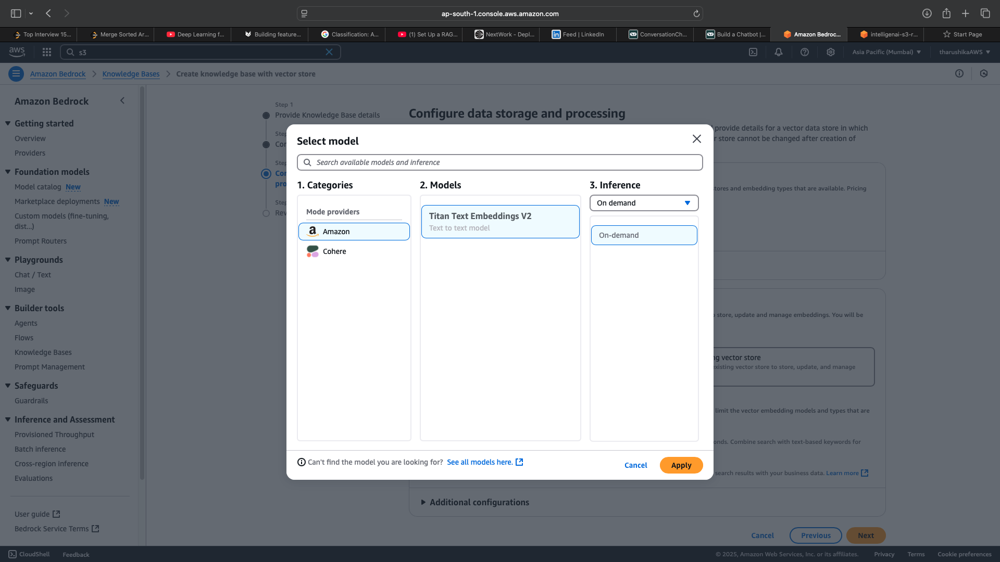
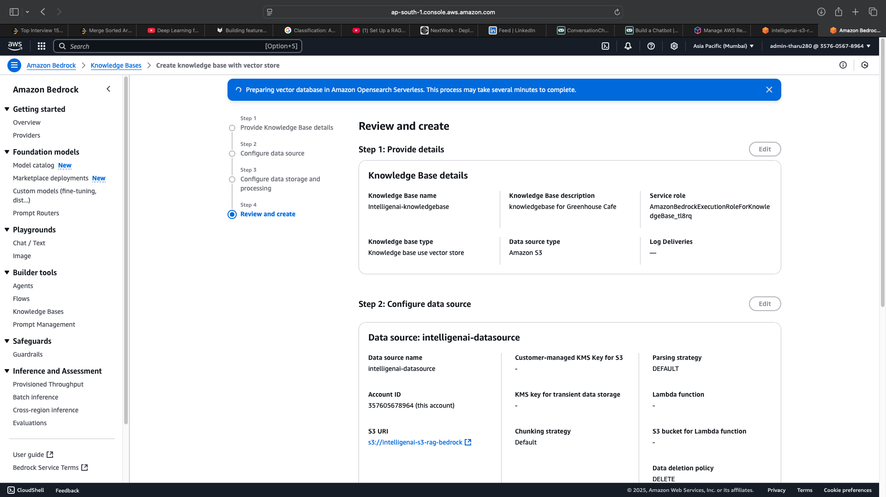
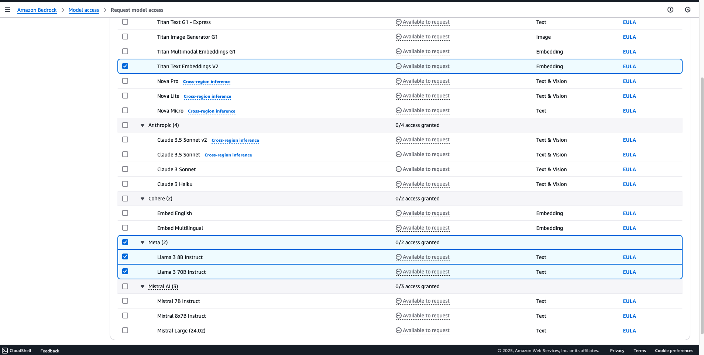
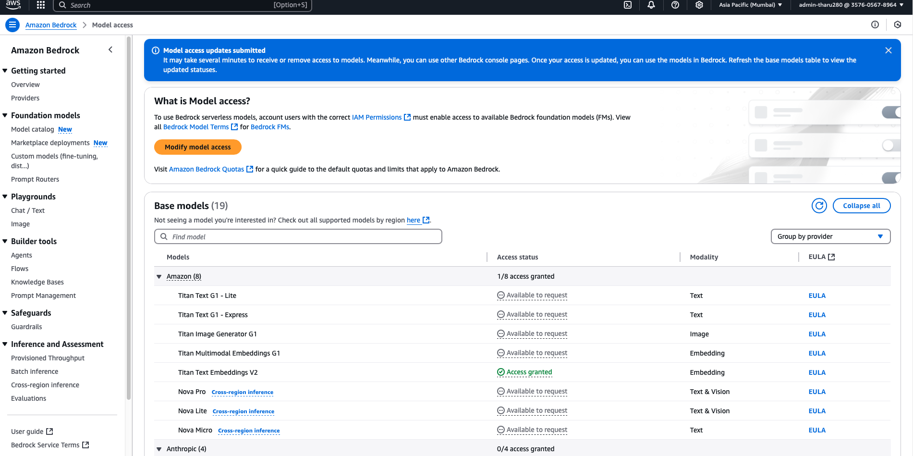
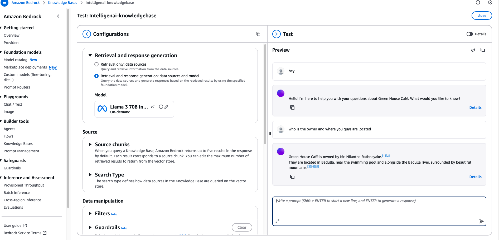
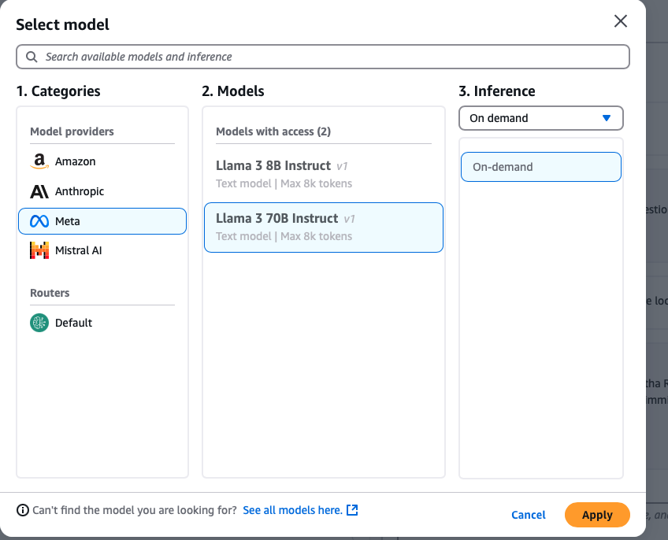
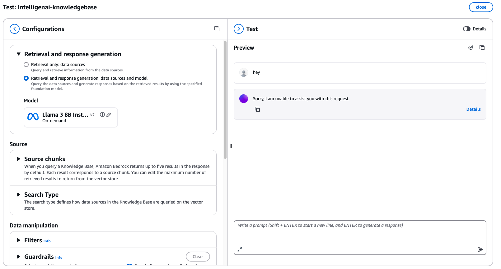
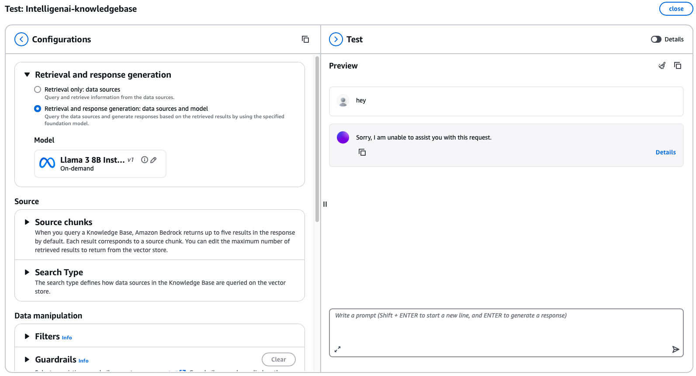
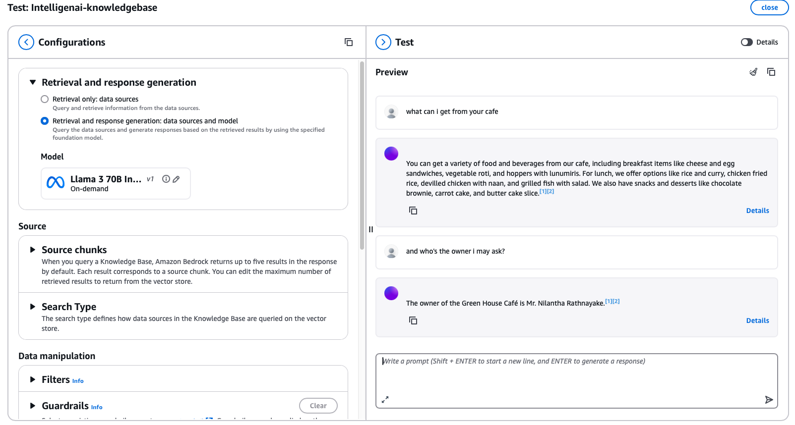
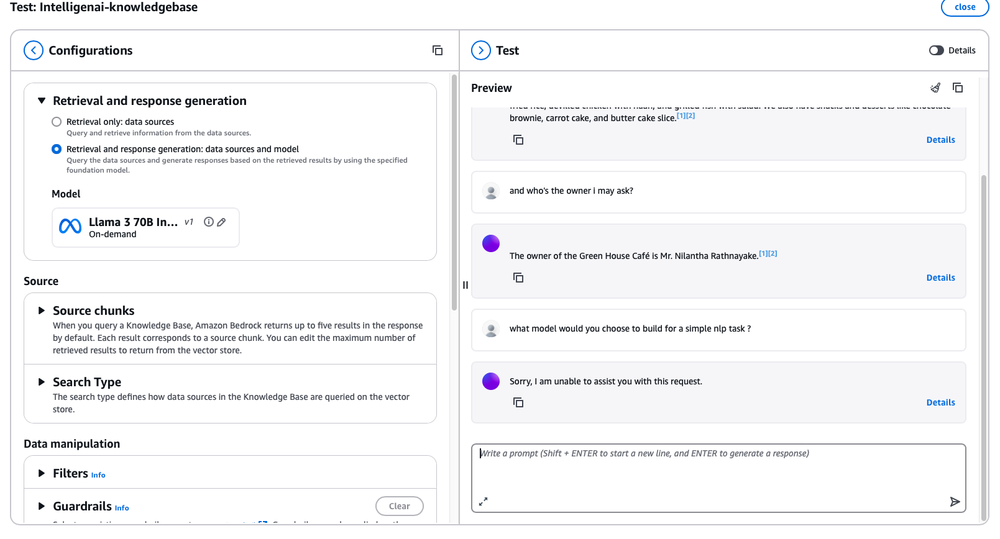

# Green House Cafe – AI-powered Chatbot with RAG (Retrieval-Augmented Generation)

This project is a production-ready AI-powered chatbot built for **Green House Cafe**.  The system leverages **Amazon Bedrock**, **Amazon S3**, and **Amazon OpenSearch Serverless** to enable natural language interaction with internal business documents like menus, operating hours, and pricing.

---

## 🔧 Tech Stack

- **Amazon Bedrock** – for foundation models (LLaMA 3 70B / Titan Text G1 – Lite)
- **Amazon S3** – for document storage
- **Amazon OpenSearch Serverless** – for vector database and semantic retrieval
- **IAM Roles & Policies** – for secure access and permissions
- **Prompt Engineering** – for optimized, contextual responses

---

## ⚙️ Features

- Upload and manage business-specific documents (menu, location, hours, etc.) in S3
- Automatic vector embedding and indexing in OpenSearch
- Real-time Q&A chatbot responses generated using Bedrock
- Fully managed permissions using IAM
- Scalable and modular architecture for small businesses

---

## 📸 Screenshots

